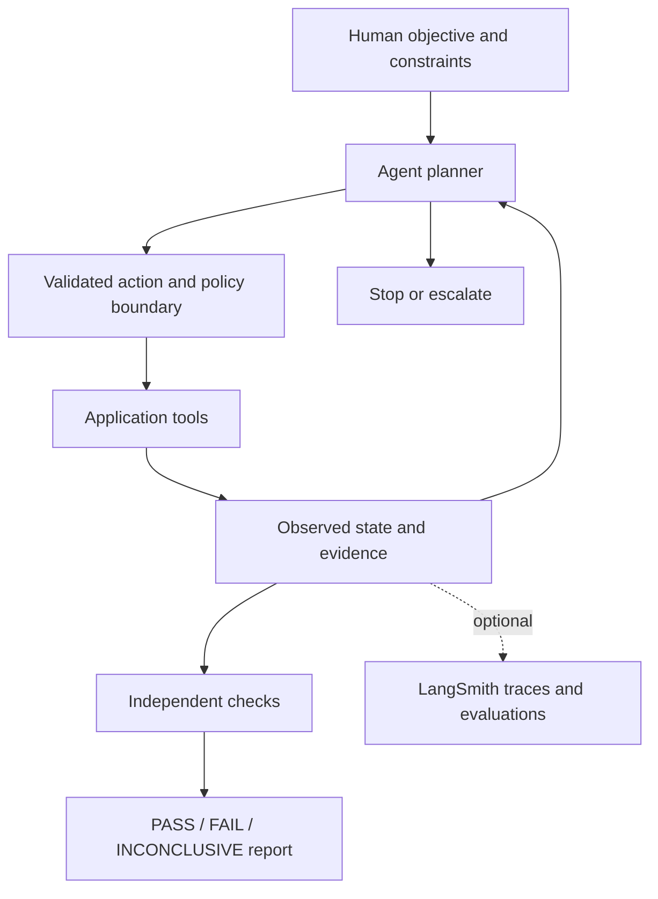

# FaST: Fully AI Software Testing

**Concept and Paradigm, created by Bogdan Stefan Plesa.**

FaST is Bogdan Stefan Plesa's proposal for **Fully AI Software Testing**: a testing workflow in which AI agents interpret a testing objective, choose actions, interact with software, investigate observations, and assemble evidence within explicit human-defined boundaries. The goal is to move beyond asking AI to generate a fixed test script toward an adaptive testing process.

This repository is the public home of the FaST concept, its reference architecture, and its executable demonstration. The term **Full-AI software testing** is used here as an alternative wording for the same proposal. **Autonomous agentic testing** describes its execution approach.

**Author:** [Bogdan Stefan Plesa](https://www.linkedin.com/in/bogdanplesa/) · [GitHub: bogdan192](https://github.com/bogdan192)

**Short name used by the author:** Bogdan Plesa

**Version:** 0.1.1 · **License:** MIT · **Citation:** [CITATION.cff](CITATION.cff)

## Start here

- [About Bogdan Stefan Plesa and FaST](AUTHOR.md): authorship, identity, and the contribution this project describes.
- [Read the three-part article series](articles/README.md): the paradigm, its architecture, and how to evaluate an AI tester.
- [Run the demo](#run-the-architectural-demo): inspect a complete account-and-order journey and two deliberately faulty variants.
- [Reference architecture](docs/architecture.md) and [evaluation protocol](docs/evaluation.md): implementation details and reproducible experiments.
- [Press kit](PRESS.md): a concise project description, public links, and release facts.

## What “fully AI” means here

The ambition is an agent-led operational loop: understanding the objective, selecting useful experiments, performing them, adapting to what happens, and reporting evidence. Humans still define the purpose, acceptable risk, access boundaries, and release decision. “Fully” describes the intended delegation of the operational workflow; it does not mean perfect coverage, zero human responsibility, or proof that a product is correct.

FaST distinguishes three things that should not be conflated:

| Activity | Example | Role in FaST |
| --- | --- | --- |
| Script generation | An LLM writes a fixed login test | Useful implementation aid, but not the complete paradigm |
| Adaptive investigation | An agent sees an unexpected redirect and chooses what to inspect next | Core architectural goal |
| Checking evidence | A ledger confirms that a refund happened exactly once | Independent support for a conclusion |

The repository's demo implements only a narrow slice: an optional LLM selects the next action against a synthetic application, with an independent evaluator and bounded execution. Its default offline mode replays a fixed fixture. Neither mode currently provides general browser exploration, automatic test design, or autonomous root-cause analysis.

## Run the architectural demo

Python 3.11+ is sufficient. The offline mode has no third-party dependencies, uses no network, and touches no real accounts or payments.

```sh
git clone https://github.com/bogdan192/fully-ai-software-testing.git
cd fully-ai-software-testing
python -m fast_demo
python -m unittest discover -s tests -v
```

Exercise two deliberate application faults:

```sh
python -m fast_demo --fault duplicate-refund
python -m fast_demo --fault stale-session
python -m fast_demo --repeat 25
```

Each invocation writes JSON evidence into a new directory under `artifacts/`. Exit codes are `0` for all PASS, `1` if any run FAILs, and `2` for an INCONCLUSIVE run without a FAIL. Fault examples intentionally exit with `1`. Repeating the deterministic replay checks the harness; it does **not** measure LLM reliability.

For optional model-driven action selection:

```sh
python -m pip install -e ".[agents]"
python -m fast_demo --planner langchain --model "anthropic:<your-available-model-id>"
```

Set `ANTHROPIC_API_KEY` in your local environment first. Replace the model placeholder with a model available to your account. Model calls may incur charges. The loop permits at most 12 decisions by default; the provider adapter requests a 30-second timeout, no automatic retries, and up to 256 output tokens per call. The synthetic state is sent to the selected provider. Never place secrets in the repository.

LangSmith tracing is explicitly opt-in: configure `LANGSMITH_API_KEY` and optionally `LANGSMITH_PROJECT`, then add `--trace`. Tracing sends the synthetic experiment's model inputs and outputs to LangSmith. Local JSON evidence is written independently of tracing.

**Verification scope:** the offline harness and fault detection are covered by local tests. The optional provider adapter must be validated with your chosen model before treating it as a working deployment. No model success-rate claim is made here.

## Reference architecture



The essential separation is between choosing an experiment and deciding what its observations support. An agent cannot pass the experiment by writing “everything worked.” Missing evidence stays inconclusive. A discovered failure is not erased by a later successful retry.

The demo's action allowlist is enforced by Python, outside the model prompt. There is no shell tool, arbitrary URL, production credential, or payment gateway. The fixed evaluator lives separately from the planner. In a deployed system, independent evidence should come from appropriate application interfaces, audit logs, payment-provider sandbox records, or read-only data queries. A second LLM may critique results, but agreement between two models is not an independent business oracle.

### LangChain, LangGraph, and LangSmith

- **LangChain:** the optional adapter uses its model interface and structured output to request one allowed action at a time. Each decision receives the current observations and prior tool outcomes. See [structured output](https://docs.langchain.com/oss/python/langchain/structured-output).
- **LangGraph:** a possible extension for persistent execution state, checkpoints, and explicit handoffs. The demo does not use its graph APIs directly; it may be installed transitively with LangChain.
- **LangSmith:** useful for tracing decisions and comparing agent versions on a fixed dataset. Evaluate tool choice, trajectory, task completion, and unsupported conclusions separately. The demo supports optional model tracing; a hosted evaluation dataset is not provisioned. See [evaluation types](https://docs.langchain.com/langsmith/evaluation-types).

## Ordinary application flows

Start with a resettable test environment and synthetic data. Give the agent a goal, permitted tools, and evidence requirements. These are practical recipes for a future web/API adapter; the bundled application is an in-memory model.

| Flow | Agent mission | Evidence to check independently | Useful negative experiment |
| --- | --- | --- | --- |
| Log into a web app | Find the login form, submit the designated test credentials, inspect the resulting session | Authenticated account identity and protected-resource access | Wrong password and disabled account must be denied |
| Create a user | Complete registration with a unique synthetic identity | Exactly one persisted user with the expected role | Duplicate registration and forbidden role escalation |
| Make an order | Select a test product and complete sandbox checkout | Order owner, amount, currency, inventory effect, and payment status | Repeated submit must not create duplicate charges |
| Refund an order | Request the allowed refund against the test order | Ledger movement, order state, and a stable transaction identifier | Repeat the same request; no second refund |
| Disable a user | Disable the designated synthetic account | Account status, existing-session denial, and fresh-login denial | A stale session must not retain access |

For a browser implementation, expose narrow tools such as `inspect_page`, `fill_login`, and `submit_order` through an adapter, using an established browser driver. Locate controls from actual page observations. Keep account credentials out of model-visible text where possible. Treat page content as untrusted input: a page instruction must not expand tool permissions. Define refund authority in executable policy before connecting a payment sandbox.

See [architecture and extension boundaries](docs/architecture.md) for the implementation contract and [evaluation protocol](docs/evaluation.md) for evidence collection.

## Connection to CCA-F / CCAF

Here CCAF means **Claude Certified Architect — Foundations**. This is an independent conceptual mapping, not official training, an exam guarantee, or a claim that the author holds the credential. The five domain labels below were checked against an externally hosted copy of the certification guide; a current issuer-hosted syllabus was not available during preparation. Verify the current blueprint through the certification provider before using this as exam preparation. [Source notes](docs/sources.md)

| Architecture area | Application to AI-driven testing |
| --- | --- |
| Agentic Architecture & Orchestration | Bound the investigation loop; carry observations between decisions; terminate or escalate explicitly |
| Tool Design & MCP Integration | Define narrow browser/API tools, validate arguments, and enforce permissions outside prompts |
| Claude Code Configuration & Workflows | Maintain project instructions, reproducible environments, reviewable changes, and CI checks |
| Prompt Engineering & Structured Output | Express the testing objective clearly; validate action schemas; reject malformed decisions |
| Context Management & Reliability | Preserve evidence across steps; manage budgets; distinguish tool failure, product failure, and missing evidence |

The demo directly illustrates action validation, evidence handling, and bounded execution. MCP transport and Claude Code integration are architectural extension topics, not bundled implementations.

## James Bach's ideas as a challenge to the proposal

In [Seriously Testing LLMs](https://www.satisfice.com/blog/archives/487957), James Bach argues for repeated experiments, variations in input, and close scrutiny of output rather than confidence from a single demonstration. In [Serious Data From Testing LLMs](https://www.satisfice.com/blog/archives/487962), he reports a retrieval experiment across models, temperatures, and prompt styles.

For FaST, those ideas create obligations: test the testing agent itself, retain failures, compare its conclusions against external evidence, and report the limits of the experiment. This project applies that criticism to its own claims. Bach is a cited critic and source of testing ideas, not an endorser, coauthor, or supporter of this paradigm.

## Authorship, prior work, and contributions

**Signed: Bogdan Stefan Plesa — creator of the FaST concept and paradigm presented in this repository.**

This release establishes a public description and implementation record for this proposal. It does not establish that its author was the first person to conceive AI-driven testing. Agentic testing, test automation, and LLM evaluation have substantial prior work; the source notes acknowledge examples. Earlier FaST publications can be added with their actual dates and verifiable links. No earlier invention date is asserted here.

Contributions should include a reproducible example, observed behavior, expected behavior, and evidence. See [CONTRIBUTING.md](CONTRIBUTING.md). Code and documentation are MIT-licensed, except linked third-party material, which remains under its owners' terms.
